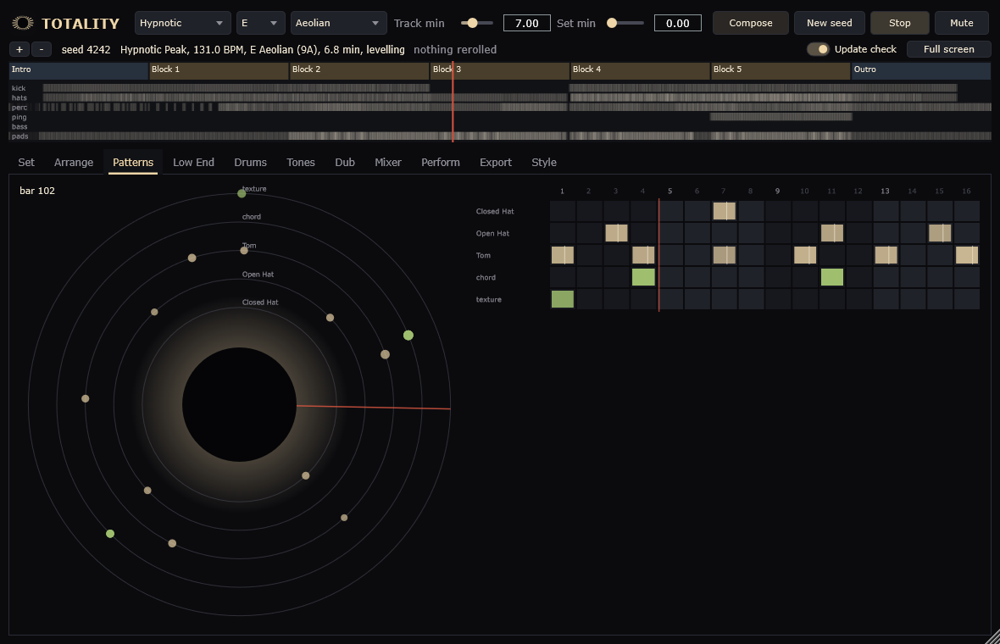
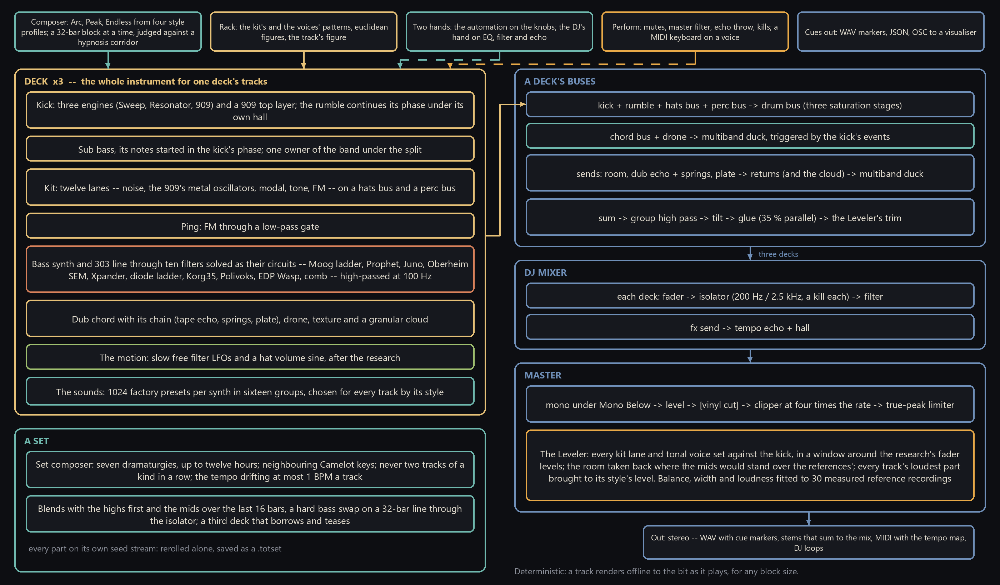
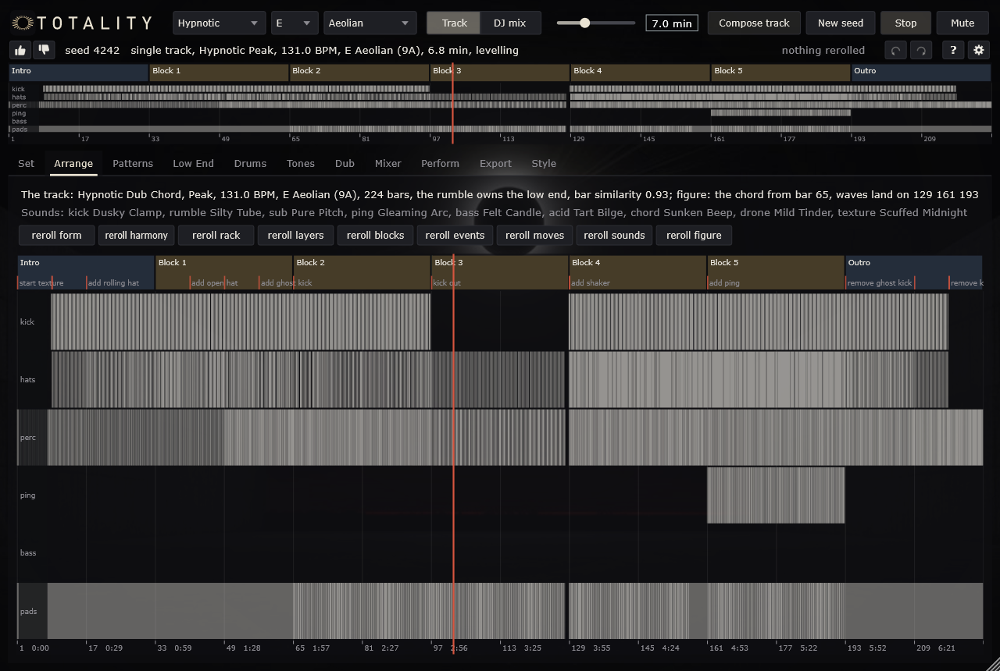
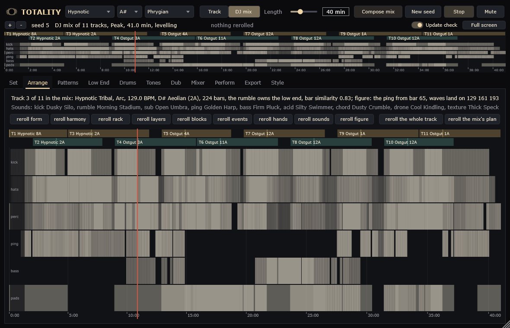
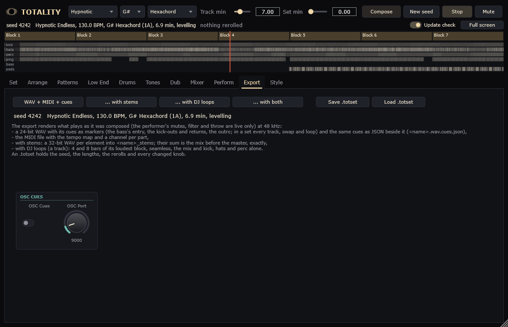
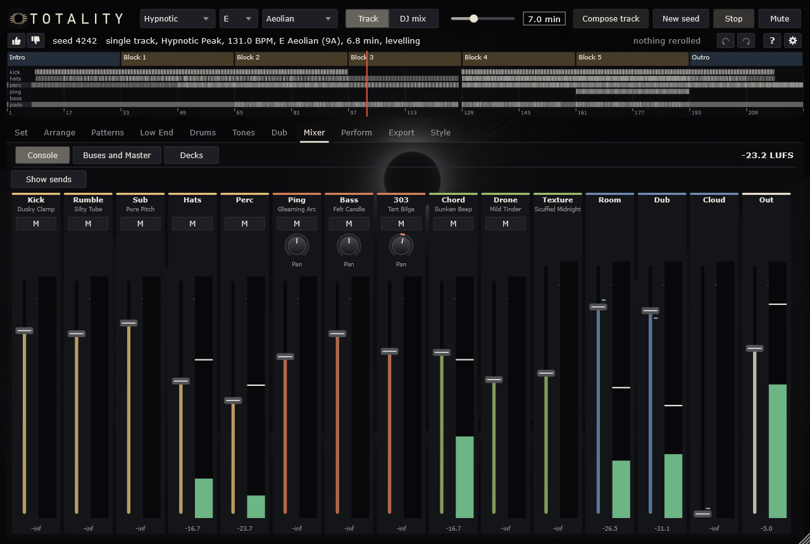

# Totality

A generator of hypnotic Berlin techno: tracks of 32-bar plateaus and whole DJ sets, composed from a seed and
synthesised while they play -- a kick that hands its phase to the rumble under it, a twelve-lane kit, the ping, a
bass and a 303 through circuit-modelled filters, the dub chord in its echoes and springs, and a DJ who mixes the
tracks into one long recomposition. Everything is synthesised; nothing is played back from a recording.

**VST3 plugin and standalone application** for Windows (x64), a command-line renderer, and a native app for **Meta
Quest**. Licence: AGPL-3.0.

<br clear="left" />



## Download

**[Totality-1.1.0-Setup.exe](https://github.com/reneweller-coding/Totality/releases/download/v1.1.0/Totality-1.1.0-Setup.exe)**
installs the standalone, the VST3, the offline renderer and the manual. Nothing else has to be installed: the runtime
is linked in. There is a
**[portable zip](https://github.com/reneweller-coding/Totality/releases/download/v1.1.0/Totality-1.1.0-portable.zip)**
for anyone who would rather not run an installer, the
**[Quest app](https://github.com/reneweller-coding/Totality/releases/download/v1.1.0/TotalityQuest-1.1.0.apk)**
(installed with `adb install -r`, developer mode; not yet run on a headset), and the
**[manual](https://github.com/reneweller-coding/Totality/releases/download/v1.1.0/Totality-Manual.pdf)** -- every
page of the panel as a picture and what each control does.

Requirements: Windows 10 or 11, a 64-bit processor with AVX2 (every x86-64 since 2013), and a VST3 host if you want
the plugin; Meta Quest 2 or later for the app. The installer is not code-signed: Windows' SmartScreen may warn once.

## How it is put together



## The composer

* **Tracks in three forms** -- the Arc (the DJ tool: intro, a body that builds its full groove, outro), the Peak (a
  long kick-out and the densest block after it), the Endless (full from the first bar, changing by exchange) -- from
  four style profiles, **Hypnotic, Ostgut, Dub and Raw Peak**, which morph into each other, or a style of your own. A
  track is a seed: the same seed gives the same track, sample for sample.
* **One operation per 32-bar block**, events on the 8-bar lines, automation by two hands; eight candidates per block,
  the one chosen that keeps the bar similarity inside a corridor fitted to thirty reference tracks.
* **A figure and waves.** Every track has a voice it is remembered by -- a ping motif, a dub stab, a bass riff or a
  303 line --, and its body runs in waves of 32 or 64 bars that build towards a landing, drop something away just
  before it and breathe in between.
* **Kinds.** Every track is a Tool, Roller, Stab, Acid, Bleep, Dub Chord or Tribal, drawn by its style; a set never
  plays two of a kind in a row. The thumbs rate what plays, and with Favor Ratings the liked kinds and sounds come more
  often.
* **Reroll any part on its own** -- form, harmony, rack, layers, blocks, events, hands, sounds, figure -- and keep
  the result as a small `.totset` file.

## Sets

* **One long recomposition**, up to twelve hours: seven dramaturgies of tempo and energy, tracks in neighbouring
  Camelot keys, the tempo drifting by at most 1 BPM a track, about twenty tracks an hour.
* **Blends as a Berlin DJ mixes:** the highs first, the mids over the last 16 bars, the bass swapped hard on a 32-bar
  line through the isolator where the incoming track's figure lands; a third deck that borrows (the last track's hats
  carried on, the next one's figure teased in, a loop of the one before layered under); the DJ's hand on the EQs,
  filter and echo between the blends.

## The sound

* **The low end as one system:** a kick of three engines (Sweep, Resonator, 909) with a 909 top layer; the rumble,
  which continues the kick's phase under its hall; a sub bass whose notes start in the kick's phase.
* **A twelve-lane kit** with the 909's metal oscillators, noise, modal, tone and FM voices; **the ping**, FM through a
  low-pass gate; **a bass synth and a 303 line** through ten filters solved as their circuits (Moog ladder, Prophet,
  Juno, Oberheim SEM, Xpander, diode ladder, Korg35, Polivoks, EDP Wasp, comb); **the dub chord** with its tape echo,
  springs and plate; drone, texture and a granular cloud.
* **1024 factory presets per synth** in sixteen groups; the composer chooses one per synth and per kit lane for every
  track, by its style, and the knobs show them while the track plays.
* **The mix:** multiband ducking triggered by the kick's events, a track bus with tilt and parallel glue, a DJ mixer
  with isolators, a master with a clipper at four times the rate and a true-peak limiter, and a leveler that sets
  every part against the kick and brings every track's loudest part to its style's loudness -- balance, width and
  loudness fitted to 30 measured reference recordings (only their statistics are kept).

## Playing and export

* **In a DAW** Totality follows the host's transport and tempo. The **Perform** page is a mixer: seven mutes, a
  master filter, an echo throw, isolator kills and faders per deck, every control learnable from MIDI.
* **Play it yourself:** a MIDI keyboard plays a voice -- the kit, the bass, the 303, the ping, the chord, the drone, or
  each on its channel -- with the sound its page has; Replace leaves that voice's generated notes out, Layer plays over
  them, and with the composer off only what you play sounds, through the mix as composed.
* **Out:** a 24-bit WAV with cue markers, the cues as JSON and as a rekordbox collection, MIDI with the tempo map, stems
  that sum exactly to the mix, seamless 4- and 8-bar DJ loops, and OSC cues for a visualiser while it plays.

## The pages

| | |
|---|---|
|  |  |
| The track: its blocks, the rerolls and the automation | A 40-minute DJ mix, track by track |
|  |  |
| The 303: oscillator, a circuit filter, envelopes, sends | The mixer: a strip per voice, the composer's mix on the faders |

The panel is the family's -- [Phosphene](https://github.com/reneweller-coding/Phosphene) (psytrance),
[Ephemeris](https://github.com/reneweller-coding/Ephemeris) (Berlin School),
[Parhelion](https://github.com/reneweller-coding/Parhelion) (trance) and, in part,
[Noctuary](https://github.com/reneweller-coding/Noctuary) (ambient): the same header, the same order of the tabs, the
same keys (Space, Ctrl+Z / Ctrl+Y, F1, F11), the same controllers (74 the master filter, 11 the echo throw) and the
same hands on a Meta Quest -- whose controls show only while a headset sends them.

The plan, in German, with the state of every phase: [docs/PLAN.md](docs/PLAN.md). The research it rests on:
[docs/research](docs/research). The manual is built out of the program itself
([docs/manual](docs/manual/Totality-Manual.pdf)).

## Build

The same in every instrument of the family (`build.ps1`, `CMakePresets.json`, `cmake/Family.cmake`):

```powershell
.\build.ps1               # Visual Studio's compiler, Release: build\msvc (the solution), the programs in bin\msvc
.\build.ps1 icx           # Intel's oneAPI compiler: build\icx, the programs in bin\icx
.\build.ps1 msvc -Test    # and the tests (ctest)
.\build.ps1 icx -Run      # and start the standalone
.\build.ps1 quest         # the Meta Quest app: bin\quest\TotalityQuest.apk
```

| Folder | What is in it |
|---|---|
| `bin\msvc`, `bin\icx` | what can be started: the standalone, the VST3, the renderer (and the files they read) |
| `build\<preset>` | the build trees -- `build\msvc\Totality.slnx` for Visual Studio |
| `dist\` | the release: setup, portable zip, checksums (`Deploy\build_release.ps1`, from `build\release`) |
| `work\` | local data, renders and logs, never in git |

Without the script: `cmake --preset msvc`, `cmake --build --preset msvc`, `ctest --preset msvc`; the icx presets need
Visual Studio's and oneAPI's environment, which `build.ps1` sets up.

JUCE comes from `ThirdParty/JUCE`, else from the sibling Phosphene's checkout, else it is fetched (tag 9.0.1).
`TOT_BUILD_PLUGIN=OFF` builds the core, the renderer and the tests alone. The release (tests, pluginval, manual,
installer, into `dist\`): `powershell -ExecutionPolicy Bypass -File Deploy\build_release.ps1`. The Quest app: see
[Quest/README.md](Quest/README.md). `TOT_MUTE=1` starts the standalone or the plugin muted; every automated run uses
it.

## Render

```
bin/msvc/tot_render.exe --seed 7 --out track.wav --midi track.mid --stems stems --loops loops
bin/msvc/tot_render.exe --seed 7 --set "compose.style=Dub" --form peak --out dub.wav
bin/msvc/tot_render.exe --seed 2026 --set-minutes 120 --set "set.dramaturgy=Peak" --out set.wav
bin/msvc/tot_render.exe --seed 7 --reroll block4 --reroll rack.ch --save-set track.totset --plan
```

A track's tempo, key, scale and low end are drawn from its style (`compose.auto`); `--bpm`, `--low` and `--form` fix
them. Before it renders, `tot_render` measures every track -- its parts against the kick (printed as `balance`), its
loudest part's level against the style's target; `--bench` skips that and the loudness meter (`--quality quest`: the
headset's level), `--plan` renders nothing. The WAV carries cue markers (bass in, kick-outs, returns, outro; in a set
every track, swap and loop), also written beside it as JSON. `--loops dir` writes seamless 4- and 8-bar loops of the
loudest block with kick, hats and perc alone; `--stems dir` a WAV per element, their sum the mix before the master;
`--decks dir` a set's decks after their channels; `--score-json` the score for the evaluation. `--reroll unit` draws
one part again (`form`, `harmony`, `rack`, `rack.<layer>`, `layers`, `blocks`, `block<n>`, `events`, `hands`,
`sounds`, `figure`; in a set `track<n>` and `track<n>.<unit>`), leaving everything else as it was; `--save-set` and
`--load-set` keep it.

`--list` prints every parameter, `--dump-params f.json` describes them; `--set "key=value; ..."` changes them;
`--patterns` prints the layers in Tidal mini-notation, `--stats` how often each part repeats its bar.

## Measure

```
python Tools/fetch_refs.py                 # the reference audio, outside the repository
python Tools/analyze_ref.py                # statistics of the references into Tools/ref_stats.json
python Tools/analyze_ref.py track.wav      # a render, measured the same way
python Tools/eval_report.py --score track.json --wav track.wav --out report.md   # the evaluation (PLAN 13.5)
```

## Licence

AGPL-3.0, like the siblings (see LICENSE).
